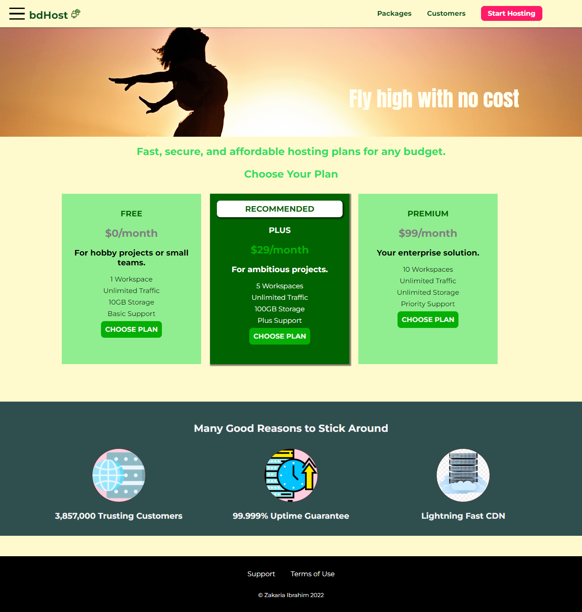
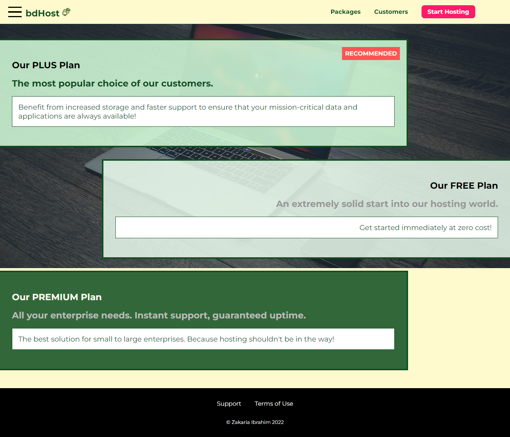
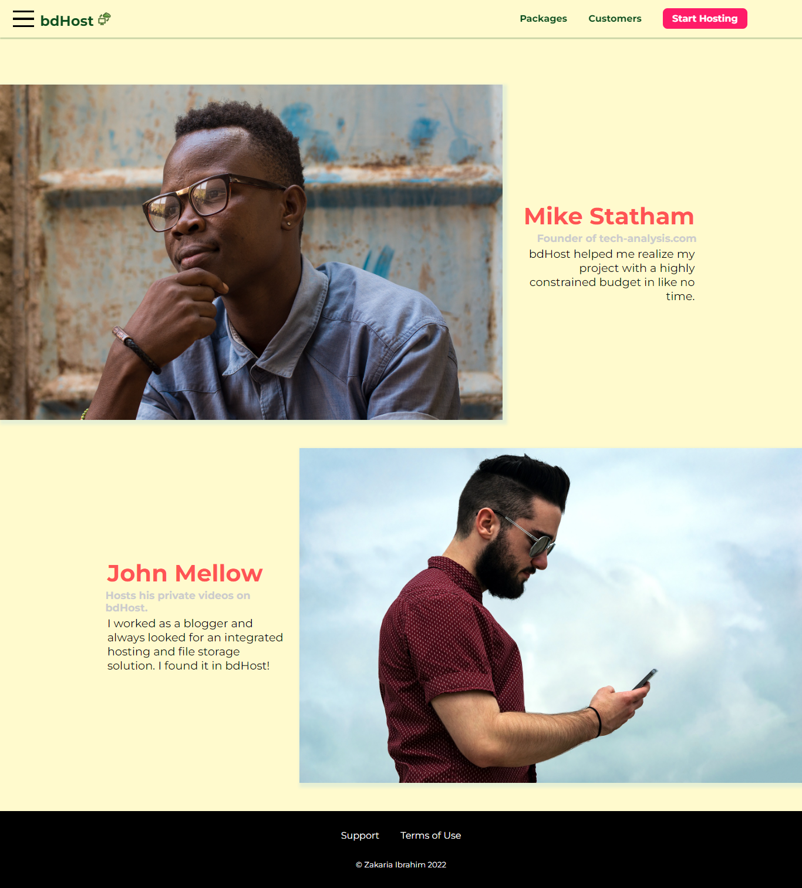
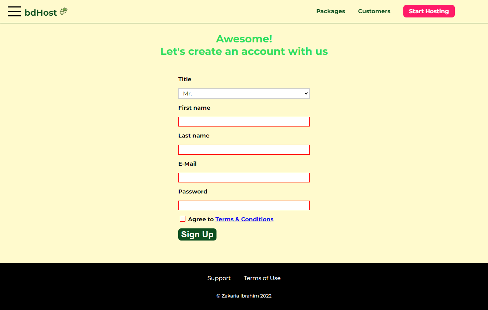
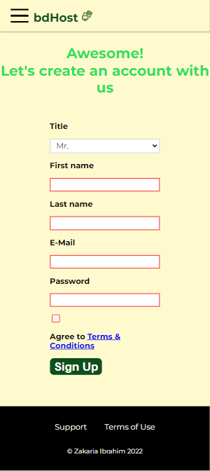

This project is a comprehensive approach to design a fully responsive website using only HTML and CSS – no framework. Basic to mid-level CSS concepts are implemented here to achieve the responsive design pattern. This project is still in progress, some more advanced CSS concepts like grid, flexbox, transitions & animations will be applied soon.
  
Live URL: [bdhost-bd.netlify.app](https://bdhost-bd.netlify.app/)
  
#Home page - desktop view:
  

  
#Home page - mobile view:
  

  
#Some more pages:
  

  

  

  

  